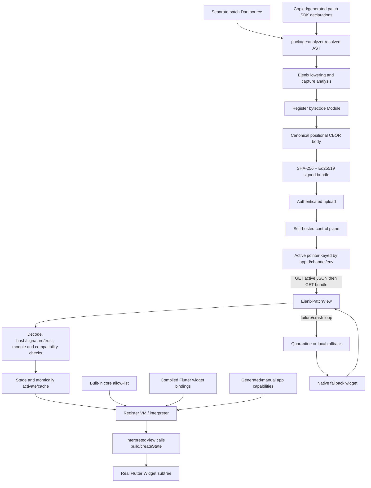

# Ejenix architecture teardown

Research date: 2026-08-22

Repository: [`ejenix/opensource`](https://github.com/ejenix/opensource)

Inspected revision: [`3e40c661b0440a5694fdaebe4ba3eb3c4e9620b4`](https://github.com/ejenix/opensource/tree/3e40c661b0440a5694fdaebe4ba3eb3c4e9620b4)

Release tag present at that revision: `v0.1.0`

## Executive finding

Ejenix is an explicit interpreted-view architecture. It does **not** replace arbitrary Dart functions in an already AOT-compiled Flutter application and does not transparently make an existing screen patchable. A developer chooses a widget subtree, replaces its host location with `EjenixPatchView` (or the lower-level `InterpretedView`), and maintains the OTA implementation as a separate Dart compilation unit written against a patch SDK. The rest of the application remains ordinary AOT Flutter code and is reachable only through capabilities compiled into the host binary.

This is a useful Architecture A baseline: it proves that signed, data-driven widget subtrees can run on stock Flutter through a Dart interpreter on both mobile platforms in principle. It does **not** establish the requested `modify normal existing Dart code -> tool patch` developer experience. The repository's own integration procedure says that one screen becomes patchable while the remainder stays native, and its scaffold generates a separate patch source plus a native host wrapper ([integration procedure](https://github.com/ejenix/opensource/blob/3e40c661b0440a5694fdaebe4ba3eb3c4e9620b4/AGENTS.md#L1-L8), [scaffold instructions](https://github.com/ejenix/opensource/blob/3e40c661b0440a5694fdaebe4ba3eb3c4e9620b4/AGENTS.md#L227-L245)).

No Ejenix implementation code was copied into this project.

## Architecture from source



### What makes code patchable

A surface is patchable only when all of these are true:

1. The shipped app contains `ejenix_flutter` and hosts the surface with `EjenixPatchView` or `InterpretedView`.
2. The patch implementation is separately compiled by Ejenix; declarations in the existing AOT app are not extracted or rewritten automatically.
3. Flutter and application APIs used by that patch are present in the patch SDK at compile time and registered in the host capability registry at runtime.
4. The downloaded bundle passes bundle, trust, bytecode, app-id, runtime-floor, and freshness checks.

`EjenixPatchView` requires the control-plane URL, app id, trusted public keys, and a cache directory. It optionally accepts a channel/environment, bundled interpreted fallback, host extensions, and a native `fallbackBuilder` ([constructor and fields](https://github.com/ejenix/opensource/blob/3e40c661b0440a5694fdaebe4ba3eb3c4e9620b4/flutter_bridge/lib/ejenix_patch_view.dart#L86-L188)). When a module is available it creates an `InterpretedView`; that view constructs an interpreter and looks up interpreted functions named `build` and optionally `createState` ([view implementation](https://github.com/ejenix/opensource/blob/3e40c661b0440a5694fdaebe4ba3eb3c4e9620b4/flutter_bridge/lib/ejenix_flutter.dart#L1206-L1379)).

Therefore:

- A normal existing screen is **not** transparently patchable.
- The developer must replace the relevant host subtree with a patch view.
- The screen's OTA implementation lives in a separate source file, normally importing copied/generated patch SDK files.
- Existing routing, state, repositories, plugins, and services stay native unless deliberately exposed as host capabilities.
- Patch-local state is recreated when a new module replaces the old one; `InterpretedView.didUpdateWidget` calls `_load`, which creates a new interpreter and reruns `createState`. Host-owned state can persist behind capabilities ([module replacement path](https://github.com/ejenix/opensource/blob/3e40c661b0440a5694fdaebe4ba3eb3c4e9620b4/flutter_bridge/lib/ejenix_flutter.dart#L1285-L1351)).

## Compiler and language model

### Frontend and AST strategy

Ejenix does not use Dart Kernel and does not modify the Dart or Flutter frontend. Its compiler creates a `package:analyzer` `AnalysisContextCollection`, requests a `ResolvedUnitResult`, rejects analyzer errors, then walks the resolved analyzer AST ([compiler frontend](https://github.com/ejenix/opensource/blob/3e40c661b0440a5694fdaebe4ba3eb3c4e9620b4/packages/compiler/lib/src/compiler.dart#L121-L230)). A warm `IncrementalCompiler` retains the analyzer context for watch mode.

Lowering is custom. `Compiler` gathers declarations in the resolved unit, `FunctionCompiler` lowers statements/expressions to bytecode, and a separate AST visitor determines captured locals and `this` capture for closure conversion ([capture analysis](https://github.com/ejenix/opensource/blob/3e40c661b0440a5694fdaebe4ba3eb3c4e9620b4/packages/compiler/lib/src/capture.dart)).

The compilation boundary is one resolved compilation unit, not an application or package graph. A referenced top-level function without an index in that unit is rejected when used as a value; an out-of-unit top-level invocation is emitted as a named host-global call, not compiled from the imported function body ([identifier handling](https://github.com/ejenix/opensource/blob/3e40c661b0440a5694fdaebe4ba3eb3c4e9620b4/packages/compiler/lib/src/function_compiler.dart#L2822-L2852), [external call lowering](https://github.com/ejenix/opensource/blob/3e40c661b0440a5694fdaebe4ba3eb3c4e9620b4/packages/compiler/lib/src/function_compiler.dart#L3598-L3623)). This is why patch SDK `external` declarations and corresponding host bindings are central to the design.

### Supported subset

The current subset is broad, but it is still a separately implemented Dart-like runtime rather than Dart AOT semantics inherited automatically from the SDK. Source and tests cover:

- primitives, typed arithmetic, comparisons, null-aware expressions, collections, records, spreads, collection control flow, and patterns;
- classes, fields, constructors, single inheritance, virtual dispatch, enums, operators, statics, generics (runtime-erased), mixins (linearized), extensions, extension types, and typedefs;
- closures with by-reference capture, tear-offs, higher-order collection calls, recursion, exceptions and `finally`;
- `async`/`await`, lazy `sync*` and `async*`, streams, `await for`, and generators;
- named/optional parameters and many modern Dart expression/statement forms.

The normative inventory and lowering notes are in the repository's [Dart subset specification](https://github.com/ejenix/opensource/blob/3e40c661b0440a5694fdaebe4ba3eb3c4e9620b4/spec/dart-subset.md). At the inspected revision it explicitly rejects top-level variables and a host-call form that skips an optional positional argument before a named argument. Imports of `dart:io`, `dart:ffi`, `dart:mirrors`, and `dart:isolate` are rejected by the compiler with `E0200` ([source check](https://github.com/ejenix/opensource/blob/3e40c661b0440a5694fdaebe4ba3eb3c4e9620b4/packages/compiler/lib/src/compiler.dart#L197-L229)).

Important scope qualifications:

- Generic type arguments are erased in the interpreted runtime.
- Imported package implementation bodies are not transitively compiled.
- Flutter APIs are available only when represented in the patch SDK and host registry.
- Riverpod, Provider, and BLoC are not transparently interpreted. Ejenix's example explicitly recommends keeping state native and exposing narrow operations instead ([example rationale](https://github.com/ejenix/opensource/blob/3e40c661b0440a5694fdaebe4ba3eb3c4e9620b4/example/patchable_app/README.md#L108-L132)).
- The finite Flutter bridge is not the Flutter framework as a whole. For example, explicit animation controllers are intentionally absent because their ticker lifecycle must belong to a host element ([binding constraint](https://github.com/ejenix/opensource/blob/3e40c661b0440a5694fdaebe4ba3eb3c4e9620b4/flutter_bridge/lib/ejenix_flutter.dart#L862-L868)).

## Bytecode, opcodes, and VM

The IR delivered to devices is a custom register bytecode `Module`, not Kernel. A module contains a typed constant pool, function prototypes, entry/static-initializer indices, globals, dynamic call sites, and class descriptors. A function contains parameter/register counts, 32-bit instruction words, closure capture indices, a function kind, and exception-handler entries ([module codec](https://github.com/ejenix/opensource/blob/3e40c661b0440a5694fdaebe4ba3eb3c4e9620b4/packages/bundle/lib/src/module_codec.dart#L39-L121)).

Instructions are fixed 32-bit words with an 8-bit opcode and three operand bytes. Operand layouts include `a`, `ab`, `abc`, `aBx`, `aSbx`, and `sAx`; `pfx` extends table indices. Numeric opcode values are explicit and documented as permanent wire values ([opcode source](https://github.com/ejenix/opensource/blob/3e40c661b0440a5694fdaebe4ba3eb3c4e9620b4/packages/bytecode/lib/src/opcode.dart#L1-L58), [instruction codec](https://github.com/ejenix/opensource/blob/3e40c661b0440a5694fdaebe4ba3eb3c4e9620b4/packages/bytecode/lib/src/instruction.dart)).

The inspected `Op` enum contains **63** opcodes, grouped around constants/moves, typed integer and double arithmetic, comparisons, branches, calls/returns, dynamic/static invocation, collections and objects, globals, closures/cells/upvalues, async/type/cast/throw/record/yield operations, and the wide prefix. This conflicts with the README's “62 opcodes” claim; source is authoritative here.

The pure-Dart interpreter uses a dense `switch`, an explicit stack of register frames, per-call-site monomorphic/polymorphic caches, a default maximum call depth of 1,024, and an optional instruction budget ([interpreter design](https://github.com/ejenix/opensource/blob/3e40c661b0440a5694fdaebe4ba3eb3c4e9620b4/packages/interpreter/lib/src/interpreter.dart#L156-L216), [dispatch and cache](https://github.com/ejenix/opensource/blob/3e40c661b0440a5694fdaebe4ba3eb3c4e9620b4/packages/interpreter/lib/src/interpreter.dart#L443-L873)). Async execution suspends interpreter frames on the host event loop. Guest calls into a registered host function execute ordinary Dart; the instruction budget cannot preempt a slow or blocking host capability.

Before staging, `verifyModule` checks structural constraints including module/table limits, opcode decoding, registers, calls, jumps, prefixes, handlers, captures, and class graph validity ([bytecode verifier](https://github.com/ejenix/opensource/blob/3e40c661b0440a5694fdaebe4ba3eb3c4e9620b4/packages/bytecode/lib/src/verifier.dart#L67-L310)).

## Widget and host capability bindings

There is no reflection-based access to arbitrary Dart objects. `HostRegistry.standard()` installs an allow-list for selected core types, collections, math/JSON helpers, futures, streams, and errors. Instance methods are resolved by receiver kind and selector; globals are resolved by name ([registry implementation](https://github.com/ejenix/opensource/blob/3e40c661b0440a5694fdaebe4ba3eb3c4e9620b4/packages/interpreter/lib/src/host_api.dart#L49-L112), [standard registry](https://github.com/ejenix/opensource/blob/3e40c661b0440a5694fdaebe4ba3eb3c4e9620b4/packages/interpreter/lib/src/host_api.dart#L196-L392)).

`flutterHostRegistry` adds hand-written bindings for a finite set of widgets, helpers, constants, framework-owned objects, navigation, implicit animation, and `setState`. Widget constructors receive a map of named arguments and return real host `Widget` instances. Interpreted closures are adapted back into Dart callbacks/builders ([Flutter registry construction](https://github.com/ejenix/opensource/blob/3e40c661b0440a5694fdaebe4ba3eb3c4e9620b4/flutter_bridge/lib/ejenix_flutter.dart#L95-L127), [representative widget bindings](https://github.com/ejenix/opensource/blob/3e40c661b0440a5694fdaebe4ba3eb3c4e9620b4/flutter_bridge/lib/ejenix_flutter.dart#L232-L520)).

Applications extend this registry manually through `HostExtension` or generate both sides from `@Patchable` annotations. `ejenix gen` reads annotations from real app code and emits a patch-facing SDK declaration plus a host binding. The annotation does **not** make the annotated implementation replaceable; it exposes that already-compiled host capability to interpreted code ([annotation source](https://github.com/ejenix/opensource/blob/3e40c661b0440a5694fdaebe4ba3eb3c4e9620b4/flutter_bridge/lib/patchable.dart), [extension seam](https://github.com/ejenix/opensource/blob/3e40c661b0440a5694fdaebe4ba3eb3c4e9620b4/flutter_bridge/lib/ejenix_flutter.dart#L1180-L1206)).

Network access is absent from the default registry. An opt-in HTTP binding permits only HTTPS and an application-provided hostname allow-list; the source recommends narrower named service capabilities instead ([HTTP capability](https://github.com/ejenix/opensource/blob/3e40c661b0440a5694fdaebe4ba3eb3c4e9620b4/flutter_bridge/lib/ejenix_flutter_http.dart), [host API policy](https://github.com/ejenix/opensource/blob/3e40c661b0440a5694fdaebe4ba3eb3c4e9620b4/spec/host-api.md#L102-L127)). Raw platform channels and plugins are not available unless the shipped app wraps them in a registered capability.

Capability compatibility is name-based, not signature-based. The runtime catches a missing capability on the executed path, but a changed argument shape under the same name may still fail inside the binding. This means the documentation's broad claim that everything unreachable fails at compile time is too strong; the view deliberately avoids a whole-module capability pre-scan and handles an actually executed missing capability at runtime ([runtime decision](https://github.com/ejenix/opensource/blob/3e40c661b0440a5694fdaebe4ba3eb3c4e9620b4/flutter_bridge/lib/ejenix_flutter.dart#L1309-L1351), [documented signature gap](https://github.com/ejenix/opensource/blob/3e40c661b0440a5694fdaebe4ba3eb3c4e9620b4/docs/production.md#L301-L327)).

## Patch channels and update protocol

A channel names one patchable surface. The server's live pointer is keyed by `(appId, channel, environment)`. `default` retains legacy routes; named channels use `/v1/apps/<app>/channels/<channel>/envs/<env>/...` ([server routes](https://github.com/ejenix/opensource/blob/3e40c661b0440a5694fdaebe4ba3eb3c4e9620b4/packages/server/lib/src/control_plane.dart#L52-L96)). Channels do not remove the explicit-view requirement: each `EjenixPatchView` is configured with the channel it follows.

The production view's device protocol is:

1. `GET` the active-pointer endpoint; the unauthenticated JSON response contains bundle id, rollout percentage, and salt.
2. Decide rollout membership locally from a persistent install id and the server-provided salt/percentage.
3. `GET /v1/apps/<app>/bundles/<id>.bundle`; an in-memory ETag avoids repeat bytes during the view's lifetime.
4. Decode, verify, stage, activate, and rebuild the interpreted subtree.
5. Repeat on app launch and foreground resume; there is no periodic background poll.

The client is deliberately fail-soft: network and malformed-protocol errors resolve as “no update,” leaving the cached/native fallback intact ([device client](https://github.com/ejenix/opensource/blob/3e40c661b0440a5694fdaebe4ba3eb3c4e9620b4/packages/loader/lib/src/control_plane_client.dart#L21-L116), [view resolver](https://github.com/ejenix/opensource/blob/3e40c661b0440a5694fdaebe4ba3eb3c4e9620b4/flutter_bridge/lib/ejenix_patch_view.dart#L275-L310)). Bundle downloads are public; app creation, upload, promotion, rollback, and delta creation require an admin or app bearer token ([server authorization](https://github.com/ejenix/opensource/blob/3e40c661b0440a5694fdaebe4ba3eb3c4e9620b4/packages/server/lib/src/control_plane.dart#L404-L438)).

## Bundle and wire format

The bundle envelope is restricted deterministic CBOR using positional arrays rather than maps:

```text
[header-bytes, public-key, signature, body-bytes]
```

The seven-field header contains magic `INTP`, major/minor version, UUIDv7 bundle id, creation time, compiler version, and SHA-256 of the body. Ed25519 signs the exact header bytes, thereby committing to the body hash. The module body written at the inspected revision is schema version 9 and includes constants, functions, entry/global/static data, call sites, classes, metadata, and release generation ([bundle implementation](https://github.com/ejenix/opensource/blob/3e40c661b0440a5694fdaebe4ba3eb3c4e9620b4/packages/bundle/lib/src/bundle.dart#L50-L187), [body encoding](https://github.com/ejenix/opensource/blob/3e40c661b0440a5694fdaebe4ba3eb3c4e9620b4/packages/bundle/lib/src/module_codec.dart#L16-L126)). Instructions are serialized little-endian, so the bundle does not depend on the device's native byte order.

The CBOR decoder rejects non-canonical integers and trailing bytes and applies length limits before allocation ([bounded decoder](https://github.com/ejenix/opensource/blob/3e40c661b0440a5694fdaebe4ba3eb3c4e9620b4/packages/bundle/lib/src/cbor.dart#L132-L228), [canonical checks](https://github.com/ejenix/opensource/blob/3e40c661b0440a5694fdaebe4ba3eb3c4e9620b4/packages/bundle/lib/src/cbor.dart#L286-L323)). Verification order is magic/version, body hash, Ed25519 signature, then membership in the host's trusted public-key set ([verification source](https://github.com/ejenix/opensource/blob/3e40c661b0440a5694fdaebe4ba3eb3c4e9620b4/packages/bundle/lib/src/bundle.dart#L150-L176)).

The compiler's `Module` output is deterministic for the same resolved source/toolchain. A complete CLI-produced bundle is **not byte-identical across ordinary rebuilds**, because `Bundle.sign` generates a fresh UUIDv7 and creation timestamp unless callers inject both; the CLI does not inject them ([bundle defaults](https://github.com/ejenix/opensource/blob/3e40c661b0440a5694fdaebe4ba3eb3c4e9620b4/packages/bundle/lib/src/bundle.dart#L103-L130), [CLI signing call](https://github.com/ejenix/opensource/blob/3e40c661b0440a5694fdaebe4ba3eb3c4e9620b4/packages/cli/lib/src/commands/compile_command.dart#L94-L118)). The README's broader byte-identical-bundle statement is therefore not true for the default CLI path.

Delta bundles use a signed CBOR envelope around a zlib-compressed COPY/ADD stream and post-apply SHA-256 ([delta specification](https://github.com/ejenix/opensource/blob/3e40c661b0440a5694fdaebe4ba3eb3c4e9620b4/spec/delta.md)). The loader can ingest and independently verify a reconstructed target, and the server can compute a delta. However, the inspected `EjenixPatchView` update path always downloads the full `.bundle` and never requests the delta endpoint. Delta primitives exist, but automatic production-view delta negotiation is **not integrated**.

## Signing and key management

Signing uses Ed25519 via `ed25519_edwards`; private material is stored as a 32-byte seed and signatures are 64 bytes ([signer implementation](https://github.com/ejenix/opensource/blob/3e40c661b0440a5694fdaebe4ba3eb3c4e9620b4/packages/bundle/lib/src/signing.dart)). The trusted key set is compiled/configured into the app, and the server also verifies uploads against keys stored in the app record.

Multiple trusted device keys make overlap rotation possible at the app-binary level. The inspected server API has app creation but no endpoint to add, remove, or rotate an existing app record's trusted keys. Consequently, end-to-end operational key rotation is not implemented as a first-class workflow. Losing the only private signing seed requires a store release with new trust material and corresponding server-side intervention.

Release generations provide downgrade/replay resistance: the device persists the highest non-zero generation it has accepted and rejects lower incoming generations ([loader freshness check](https://github.com/ejenix/opensource/blob/3e40c661b0440a5694fdaebe4ba3eb3c4e9620b4/packages/loader/lib/src/loader.dart#L156-L175)). Generation `0` opts out.

There is an unresolved interaction: operator rollback changes the server pointer to the previous bundle, but a device that already accepted a higher generated release will reject that older bundle as stale. Local device rollback bypasses ingestion and can restore the cached previous bundle. The source contains both mechanisms, but no source-level exception reconciles server rollback with monotonic generations ([server rollback](https://github.com/ejenix/opensource/blob/3e40c661b0440a5694fdaebe4ba3eb3c4e9620b4/packages/server/lib/src/control_plane.dart#L314-L350), [device rejection](https://github.com/ejenix/opensource/blob/3e40c661b0440a5694fdaebe4ba3eb3c4e9620b4/packages/loader/lib/src/loader.dart#L156-L168)).

## Caching, activation, failure, and rollback

`BundleStore` keeps `active.bundle`, verified staging bundles, up to five history bundles by default, and a JSON state record. Activation moves the prior active bundle to history, moves staging to active, then persists state. State and staging writes use sibling temporary files, flush, and rename ([store layout and activation](https://github.com/ejenix/opensource/blob/3e40c661b0440a5694fdaebe4ba3eb3c4e9620b4/packages/loader/lib/src/bundle_store.dart#L12-L169)).

The loader performs:

```text
decode envelope
  -> hash/signature/trust verification
  -> delta reconstruction if applicable
  -> body decode
  -> structural bytecode verification
  -> generation freshness
  -> app-id / min-SDK compatibility
  -> stage
```

Activation is a separate step ([loader](https://github.com/ejenix/opensource/blob/3e40c661b0440a5694fdaebe4ba3eb3c4e9620b4/packages/loader/lib/src/loader.dart#L82-L191)). `EjenixPatchView` pre-decodes a staged module, activates it, and swaps the view. It marks a patch healthy after a successful frame. Three launches without health trigger local rollback when history exists. Missing capability, non-widget output, or instruction-budget overrun causes quarantine and immediate/local rollback; repeated otherwise-unclassified render failure is escalated after three frames ([view activation](https://github.com/ejenix/opensource/blob/3e40c661b0440a5694fdaebe4ba3eb3c4e9620b4/flutter_bridge/lib/ejenix_patch_view.dart#L336-L412), [failure recovery](https://github.com/ejenix/opensource/blob/3e40c661b0440a5694fdaebe4ba3eb3c4e9620b4/flutter_bridge/lib/ejenix_patch_view.dart#L500-L616)).

Safe fallback order is cached active patch, bundled interpreted patch, then the application's native `fallbackBuilder`. If none exists, the widget shows its default loading UI; the integration guide warns maintainers not to omit a native fallback.

The bundle metadata carries a target Flutter version, and `EjenixPatchView` accepts a host Flutter version, but `HostEnvironment.isCompatible` currently checks only app id and minimum Ejenix SDK. Flutter-version compatibility is recorded but **not enforced** ([compatibility code](https://github.com/ejenix/opensource/blob/3e40c661b0440a5694fdaebe4ba3eb3c4e9620b4/packages/loader/lib/src/host_environment.dart#L23-L72)).

## Backend and self-hosting

The control plane is a Dart `shelf_router` service. It provides app registration/listing, signed bundle upload/download/listing, environment/channel pointer read/promote/rollback, delta construction, a bundled dashboard, health/readiness, and Prometheus metrics ([route table](https://github.com/ejenix/opensource/blob/3e40c661b0440a5694fdaebe4ba3eb3c4e9620b4/packages/server/lib/src/control_plane.dart#L46-L106)). Upload rejects malformed/untrusted bundles and refuses to redefine a bundle id with different bytes; downloads use a SHA-256-derived ETag ([upload/download handlers](https://github.com/ejenix/opensource/blob/3e40c661b0440a5694fdaebe4ba3eb3c4e9620b4/packages/server/lib/src/control_plane.dart#L171-L241)). Promotion is a small environment record update, and operator rollback swaps active/previous pointers.

The default persistent backend is a dependency-free filesystem store for app JSON, bundle blobs, JSONL references, and environment/channel JSON pointers. An in-memory store is available, while SQLite/Postgres are only suggested future adapters ([store interface](https://github.com/ejenix/opensource/blob/3e40c661b0440a5694fdaebe4ba3eb3c4e9620b4/packages/server/lib/src/store.dart), [file store](https://github.com/ejenix/opensource/blob/3e40c661b0440a5694fdaebe4ba3eb3c4e9620b4/packages/server/lib/src/file_store.dart)).

Self-host deployment material exists for Docker, Kubernetes, bare metal/systemd, GCP, Azure, and AWS. Docker/Kubernetes/bare metal use mounted persistence; GCP/Azure scripts configure cloud-backed storage. The AWS App Runner target is explicitly ephemeral because it has no persistent volume and is unsuitable as a durable production store ([deployment matrix](https://github.com/ejenix/opensource/blob/3e40c661b0440a5694fdaebe4ba3eb3c4e9620b4/deploy/README.md)).

## Platform and store-policy implications

The runtime, loader, and bridge are Dart/Flutter packages with no Flutter engine fork and no native plugin declaration. Downloaded content is the project's bytecode/CBOR data and is interpreted by code already in the app. Host-side native/plugin behavior is possible only through capabilities already compiled into the application.

That is technically relevant to Apple and Google policy analysis, but it is not proof of policy compliance. The repository claims production/App Store use; this teardown did not find public app identifiers, review correspondence, or reproducible store-review evidence in source. Treat the claim as unverified. Likewise, the presence of Android and iOS example shells and a platform-neutral Dart runtime supports feasibility, but the tests executed for this teardown were macOS Dart/Flutter tests, not physical-device release tests or store submissions.

## Limitations and implications for this project

1. **Explicit integration is fundamental.** Each patchable subtree must be hosted by a patch view and assigned a channel.
2. **Existing screen source is not the patch source.** Normal app Dart is not automatically transformed; teams maintain a separate Ejenix-compiled screen against patch SDK declarations.
3. **No arbitrary function replacement.** A normal AOT function such as `calculatePrice` is unchanged unless the application routes its use through the interpreted subtree or a manually designed dispatch/capability seam.
4. **Finite Flutter surface.** Unregistered widgets, inherited lookups, plugins, and framework APIs are unavailable until a store release adds bindings.
5. **Single-unit compiler boundary.** Imported implementation code is not automatically compiled into the patch.
6. **Semantic parity is maintained independently.** Each new Dart feature requires custom analyzer-AST lowering, bytecode semantics, interpreter behavior, and tests; analyzer resolution alone does not confer Dart VM compatibility.
7. **Capability evolution is operationally sensitive.** Name-only checks do not detect signature changes; new capabilities require an app release and an accurate minimum SDK floor.
8. **Host calls escape VM metering.** A capability can block, allocate, or perform sensitive work unless the application bounds it itself.
9. **Patch-local state resets on module swap.** State migration between patch versions is not provided.
10. **Delta delivery is incomplete in the production view.** Delta codecs/endpoints exist, but `EjenixPatchView` fetches full bundles.
11. **Flutter metadata is not enforced.** The field exists without a runtime compatibility decision.
12. **Operational gaps remain.** No first-class signing-key rotation, no default fleet-health telemetry, and monotonic generations conflict with server-side rollback of an older bundle.

For our architecture comparison, Ejenix demonstrates the viability and containment advantages of Architecture A, but it does not answer the primary developer-experience requirement. Achieving transparent patchability requires separate evidence for build-time or Kernel-level instrumentation.

## Evidence table

| Claim | Evidence | Source | Verified? |
|---|---|---|---|
| Ejenix uses an analyzer AST frontend, not Kernel. | `AnalysisContextCollection` resolves a unit and custom compiler code walks its declarations/AST. No Kernel dependency appears in compiler dependencies. | [compiler](https://github.com/ejenix/opensource/blob/3e40c661b0440a5694fdaebe4ba3eb3c4e9620b4/packages/compiler/lib/src/compiler.dart#L121-L242), [pubspec](https://github.com/ejenix/opensource/blob/3e40c661b0440a5694fdaebe4ba3eb3c4e9620b4/packages/compiler/pubspec.yaml) | Yes — source |
| Existing Flutter screens are transparently patchable. | Integration requires replacing a chosen subtree with `EjenixPatchView`; scaffold emits separate host and patch files. | [integration procedure](https://github.com/ejenix/opensource/blob/3e40c661b0440a5694fdaebe4ba3eb3c4e9620b4/AGENTS.md#L227-L245), [production guide](https://github.com/ejenix/opensource/blob/3e40c661b0440a5694fdaebe4ba3eb3c4e9620b4/docs/production.md#L100-L186) | **No — disproven** |
| `EjenixPatchView` is required for production OTA delivery. | It owns control-plane resolution, verification/staging, caching, activation, render fallback, and rollback. The lower-level `InterpretedView` can be wired manually instead. | [patch view](https://github.com/ejenix/opensource/blob/3e40c661b0440a5694fdaebe4ba3eb3c4e9620b4/flutter_bridge/lib/ejenix_patch_view.dart), [interpreted view](https://github.com/ejenix/opensource/blob/3e40c661b0440a5694fdaebe4ba3eb3c4e9620b4/flutter_bridge/lib/ejenix_flutter.dart#L1206-L1390) | Yes, with lower-level alternative |
| `@Patchable` makes the annotated host function replaceable. | Codegen exposes the compiled host declaration as a capability and generates patch SDK/binding plumbing; it does not rewrite callers or function bodies. | [annotation](https://github.com/ejenix/opensource/blob/3e40c661b0440a5694fdaebe4ba3eb3c4e9620b4/flutter_bridge/lib/patchable.dart), [generator](https://github.com/ejenix/opensource/blob/3e40c661b0440a5694fdaebe4ba3eb3c4e9620b4/packages/cli/lib/src/codegen/capability_gen.dart) | **No — disproven** |
| Compiler support is a broad Dart subset. | The spec and compiler tests cover modern language constructs; unsupported top-level variables and one host-call gap remain. Forbidden sandbox imports are rejected. | [subset spec](https://github.com/ejenix/opensource/blob/3e40c661b0440a5694fdaebe4ba3eb3c4e9620b4/spec/dart-subset.md), [compiler tests](https://github.com/ejenix/opensource/tree/3e40c661b0440a5694fdaebe4ba3eb3c4e9620b4/packages/compiler/test) | Yes — scoped to documented subset/tests |
| Imported Dart/package code is compiled transitively. | Only declarations in the resolved unit receive function indices; out-of-unit calls lower to host globals. | [lowering](https://github.com/ejenix/opensource/blob/3e40c661b0440a5694fdaebe4ba3eb3c4e9620b4/packages/compiler/lib/src/function_compiler.dart#L2822-L2852), [calls](https://github.com/ejenix/opensource/blob/3e40c661b0440a5694fdaebe4ba3eb3c4e9620b4/packages/compiler/lib/src/function_compiler.dart#L3598-L3623) | **No — disproven** |
| The VM is register-based and bounded. | Fixed-width register operands, explicit frame stack, max call depth, per-invocation step budget, and structural verification are implemented. | [opcodes](https://github.com/ejenix/opensource/blob/3e40c661b0440a5694fdaebe4ba3eb3c4e9620b4/packages/bytecode/lib/src/opcode.dart), [interpreter](https://github.com/ejenix/opensource/blob/3e40c661b0440a5694fdaebe4ba3eb3c4e9620b4/packages/interpreter/lib/src/interpreter.dart#L156-L216), [verifier](https://github.com/ejenix/opensource/blob/3e40c661b0440a5694fdaebe4ba3eb3c4e9620b4/packages/bytecode/lib/src/verifier.dart) | Yes — source + tests |
| The VM has 62 opcodes. | Counting explicit entries in the current `Op` enum gives 63. | [current enum](https://github.com/ejenix/opensource/blob/3e40c661b0440a5694fdaebe4ba3eb3c4e9620b4/packages/bytecode/lib/src/opcode.dart#L50-L307) | **No — stale README claim** |
| Patches can call arbitrary native/plugin APIs. | All host calls resolve through explicit global/method registries; IO/FFI/isolate/mirrors are forbidden and raw platform channels are not default capabilities. | [host registry](https://github.com/ejenix/opensource/blob/3e40c661b0440a5694fdaebe4ba3eb3c4e9620b4/packages/interpreter/lib/src/host_api.dart), [compiler boundary](https://github.com/ejenix/opensource/blob/3e40c661b0440a5694fdaebe4ba3eb3c4e9620b4/packages/compiler/lib/src/compiler.dart#L197-L229) | **No — disproven** |
| Every unavailable capability is rejected at patch compile time. | Stale/external declarations can compile; the view intentionally detects missing executed capabilities at runtime and falls back/quarantines. Signature shape changes are name-invisible. | [runtime path](https://github.com/ejenix/opensource/blob/3e40c661b0440a5694fdaebe4ba3eb3c4e9620b4/flutter_bridge/lib/ejenix_flutter.dart#L1309-L1351), [compatibility gap](https://github.com/ejenix/opensource/blob/3e40c661b0440a5694fdaebe4ba3eb3c4e9620b4/docs/production.md#L301-L327) | **No — claim is too broad** |
| Bundles are Ed25519 signed and hash verified. | Header signature, SHA-256 body commitment, trust anchors, strict verification order, and malformed input handling are implemented. | [bundle](https://github.com/ejenix/opensource/blob/3e40c661b0440a5694fdaebe4ba3eb3c4e9620b4/packages/bundle/lib/src/bundle.dart#L50-L187), [signing](https://github.com/ejenix/opensource/blob/3e40c661b0440a5694fdaebe4ba3eb3c4e9620b4/packages/bundle/lib/src/signing.dart) | Yes — source + tests |
| Default CLI builds are byte-for-byte deterministic. | Module lowering is deterministic, but bundle signing injects a fresh UUIDv7 and current timestamp; CLI supplies neither override. | [bundle defaults](https://github.com/ejenix/opensource/blob/3e40c661b0440a5694fdaebe4ba3eb3c4e9620b4/packages/bundle/lib/src/bundle.dart#L103-L130), [CLI](https://github.com/ejenix/opensource/blob/3e40c661b0440a5694fdaebe4ba3eb3c4e9620b4/packages/cli/lib/src/commands/compile_command.dart#L94-L118) | **No — only module/body determinism verified** |
| Patch channels promote and roll back independently. | Routes and persistence include channel in the environment key; default preserves legacy behavior. | [routes](https://github.com/ejenix/opensource/blob/3e40c661b0440a5694fdaebe4ba3eb3c4e9620b4/packages/server/lib/src/control_plane.dart#L52-L96), [file layout](https://github.com/ejenix/opensource/blob/3e40c661b0440a5694fdaebe4ba3eb3c4e9620b4/packages/server/lib/src/file_store.dart#L92-L144) | Yes — source + server tests |
| Full-bundle caching, atomic activation, history, manual rollback, and crash-loop rollback exist. | `BundleStore`, `Loader`, and `EjenixPatchView` implement these paths. | [store](https://github.com/ejenix/opensource/blob/3e40c661b0440a5694fdaebe4ba3eb3c4e9620b4/packages/loader/lib/src/bundle_store.dart), [loader](https://github.com/ejenix/opensource/blob/3e40c661b0440a5694fdaebe4ba3eb3c4e9620b4/packages/loader/lib/src/loader.dart), [view](https://github.com/ejenix/opensource/blob/3e40c661b0440a5694fdaebe4ba3eb3c4e9620b4/flutter_bridge/lib/ejenix_patch_view.dart) | Yes — source + tests |
| Automatic delta delivery is used by `EjenixPatchView`. | Delta codec/server/loader paths exist, but the view resolves and downloads only the full bundle URL. | [delta](https://github.com/ejenix/opensource/blob/3e40c661b0440a5694fdaebe4ba3eb3c4e9620b4/packages/delta/lib/src/delta_bundle.dart), [view fetch](https://github.com/ejenix/opensource/blob/3e40c661b0440a5694fdaebe4ba3eb3c4e9620b4/flutter_bridge/lib/ejenix_patch_view.dart#L275-L310) | **No — primitives only, integration absent** |
| Target Flutter version is enforced before activation. | Metadata carries it and host accepts it, but compatibility code checks only app id and min SDK. | [metadata](https://github.com/ejenix/opensource/blob/3e40c661b0440a5694fdaebe4ba3eb3c4e9620b4/packages/bundle/lib/src/metadata.dart), [host check](https://github.com/ejenix/opensource/blob/3e40c661b0440a5694fdaebe4ba3eb3c4e9620b4/packages/loader/lib/src/host_environment.dart#L23-L72) | **No — field currently unused** |
| Control plane is fully self-hostable. | Server and filesystem store are open source; deployment scripts cover local/container/cloud options. Durability differs by target. | [server](https://github.com/ejenix/opensource/tree/3e40c661b0440a5694fdaebe4ba3eb3c4e9620b4/packages/server), [deployment](https://github.com/ejenix/opensource/blob/3e40c661b0440a5694fdaebe4ba3eb3c4e9620b4/deploy/README.md) | Yes — implementation present; live cloud deployments not tested here |
| Production fleet health is available. | The control plane has no device registry/reporting; docs name fleet health as unimplemented. `onStatus` must be connected to app logging. | [known limitation](https://github.com/ejenix/opensource/blob/3e40c661b0440a5694fdaebe4ba3eb3c4e9620b4/docs/production.md#L604-L632) | **No — explicitly absent** |
| Runtime and patch format are MIT-licensed. | Root license grants MIT terms; repository records third-party permissive dependencies and font notices. | [LICENSE](https://github.com/ejenix/opensource/blob/3e40c661b0440a5694fdaebe4ba3eb3c4e9620b4/LICENSE), [notices](https://github.com/ejenix/opensource/blob/3e40c661b0440a5694fdaebe4ba3eb3c4e9620b4/THIRD_PARTY_NOTICES.md) | Yes — license file inspected |
| Android and iOS production/store operation is proven by this public repository. | Flutter bridge is platform-neutral and example shells exist, but public source does not independently prove store acceptance or physical-device release behavior. | [example app](https://github.com/ejenix/opensource/tree/3e40c661b0440a5694fdaebe4ba3eb3c4e9620b4/example/patchable_app), [bridge pubspec](https://github.com/ejenix/opensource/blob/3e40c661b0440a5694fdaebe4ba3eb3c4e9620b4/flutter_bridge/pubspec.yaml) | **Unverified** |

## Validation performed

At the inspected revision, on macOS arm64 with Dart 3.13.0 and Flutter 3.47.0:

- `dart pub get` succeeded in the cloned Ejenix workspace.
- Package-scoped `dart test -r failures-only` passed for all eight pure-Dart packages: 792 tests total (`bytecode` 74, `interpreter` 118, `compiler` 302, `bundle` 57, `delta` 12, `loader` 64, `cli` 116, `server` 49).
- `flutter pub get` and `flutter test -r failures-only` passed for `flutter_bridge`: 50 tests.
- Total observed passing tests were 842. This differs from the README's “787 tests,” another sign that its headline counts lag current source.

These runs validate unit/widget behavior on the local host. They do not validate Android/iOS release AOT execution, device networking/background behavior, cloud deployment scripts, app-store review, or real fleet behavior.

## Primary sources inspected

- Compiler, bytecode, interpreter, bundle, delta, loader, CLI, server, and Flutter bridge source at the pinned revision.
- `spec/bytecode.md`, `spec/dart-subset.md`, `spec/bundle.md`, `spec/delta.md`, and `spec/host-api.md`.
- `docs/production.md`, `docs/getting-started.md`, `deploy/README.md`, the example patchable app, tests, `LICENSE`, and `THIRD_PARTY_NOTICES.md`.
